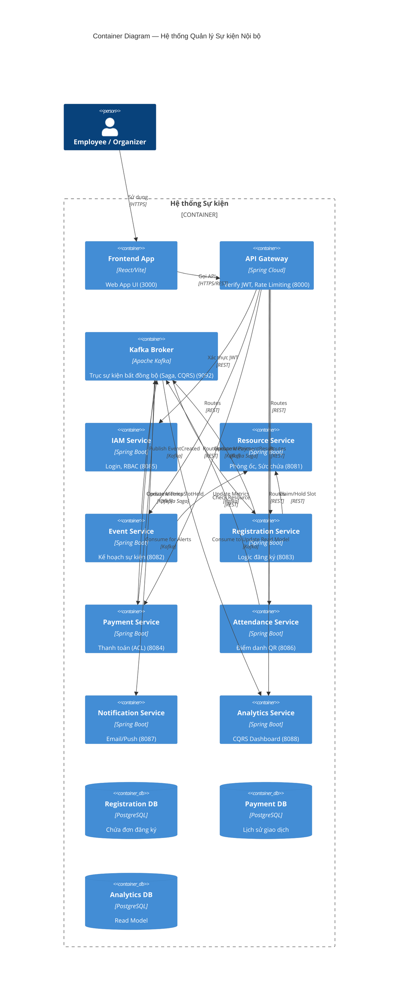

# Hệ thống Quản lý Sự kiện Nội bộ (Internal Event Management)

[](https://github.com/hungdn1701/microservices-assignment-starter/stargazers)
[](https://github.com/hungdn1701/microservices-assignment-starter/network/members)
[](LICENSE)

> Hệ thống tự động hóa quy trình quản lý sự kiện nội bộ theo hướng Domain-Driven Design (DDD). Cung cấp nền tảng end-to-end từ việc lập kế hoạch sự kiện, cấp phát phòng ốc, đăng ký vé (thu phí và miễn phí) qua Saga, điểm danh bằng mã QR động, đến dashboard phân tích số liệu thời gian thực (CQRS).

---

## Team Members

| Name | Role | Contribution |
|------|------|-------------|
| Tạ Trường Vũ | ... | ... |
| Đỗ Văn Dũng | ... | ... |

---

## Business Process

- **Domain**: Quản lý sự kiện nội bộ doanh nghiệp.
- **Actors**: Organizer (Người tổ chức) và Employee (Nhân viên tham gia).
- **Quy trình trọng tâm**:
  1. **Lập kế hoạch**: Organizer cấu hình sự kiện, yêu cầu Resource Service giữ/chuẩn bị phòng ốc.
  2. **Đăng ký (Core)**: Employee đăng ký tham gia.
    - Với vé miễn phí: Hệ thống trừ số lượng chỗ và xác nhận trực tiếp.
    - Với vé thu phí: Hệ thống chạy **Saga Choreography**, giữ chỗ tạm thời và yêu cầu thanh toán (qua Payment Service và VNPay/Momo ACL). Nếu thanh toán thành công, xác nhận đăng ký; nếu thất bại/timeout, hoàn lại chỗ.
  3. **Tổ chức & Điểm danh**: Organizer bật màn hình QR động. Employee dùng app để quét mã QR check-in/check-out.
  4. **Theo dõi & Phân tích (CQRS)**: Mọi Event được truyền qua Kafka về Analytics Service để cập nhật Dashboard số liệu realtime cho Organizer.

---

## Architecture



| Component | Responsibility | Tech Stack | Port |
|---|---|---|---|
| **Frontend** | Giao diện Employee/Organizer | React / Vite | 3000 |
| **Gateway** | Routing, JWT Auth | Spring Cloud Gateway | 8000 |
| **IAM Service** | Quản lý user, cấp JWT | Spring Boot, PostgreSQL | 8085 |
| **Resource Service** | Danh mục phòng/thiết bị | Spring Boot, PostgreSQL | 8081 |
| **Event Service** | Cấu hình sự kiện | Spring Boot, PostgreSQL | 8082 |
| **Registration Service** | Giữ chỗ, đăng ký (Core) | Spring Boot, PostgreSQL | 8083 |
| **Payment Service** | Xử lý thanh toán, Saga | Spring Boot, PostgreSQL | 8084 |
| **Attendance Service** | Sinh QR, kiểm tra check-in | Spring Boot, Redis, PG | 8086 |
| **Notification Service**| Gửi Email/Push | Spring Boot, PostgreSQL | 8087 |
| **Analytics Service** | Dashboard thống kê (CQRS) | Spring Boot, PostgreSQL | 8088 |

---

## Quick Start

```bash
docker compose up --build
```

Verify: `curl http://localhost:8000/health`

> For full setup instructions, prerequisites, and development commands, see [`GETTING_STARTED.md`](GETTING_STARTED.md).

---

## Documentation

| Document | Description |
|----------|-------------|
| [`GETTING_STARTED.md`](GETTING_STARTED.md) | Setup, workflow, submission checklist |
| [`analysis-and-design.md`](analysis-and-design.md) | Analysis & Design — Step-by-Step Action approach |
| [`analysis-and-design-ddd.md`](analysis-and-design-ddd.md) | Analysis & Design — Domain-Driven Design approach |
| [`architecture.md`](architecture.md) | Architecture patterns, components & deployment |
| [`api-specs/`](api-specs/) | OpenAPI 3.0 & AsyncAPI specifications for each service |

---

## License

This project uses the [MIT License](LICENSE).

> Template by [Hung Dang](https://github.com/hungdn1701) · [Template guide](GETTING_STARTED.md)
