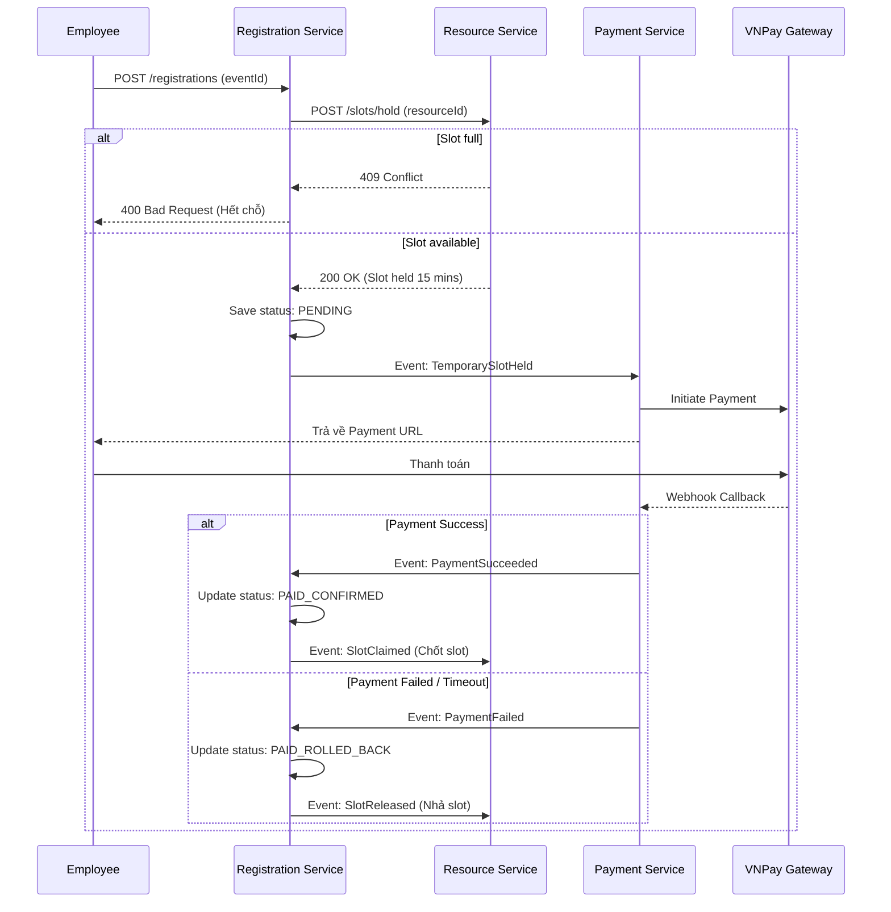
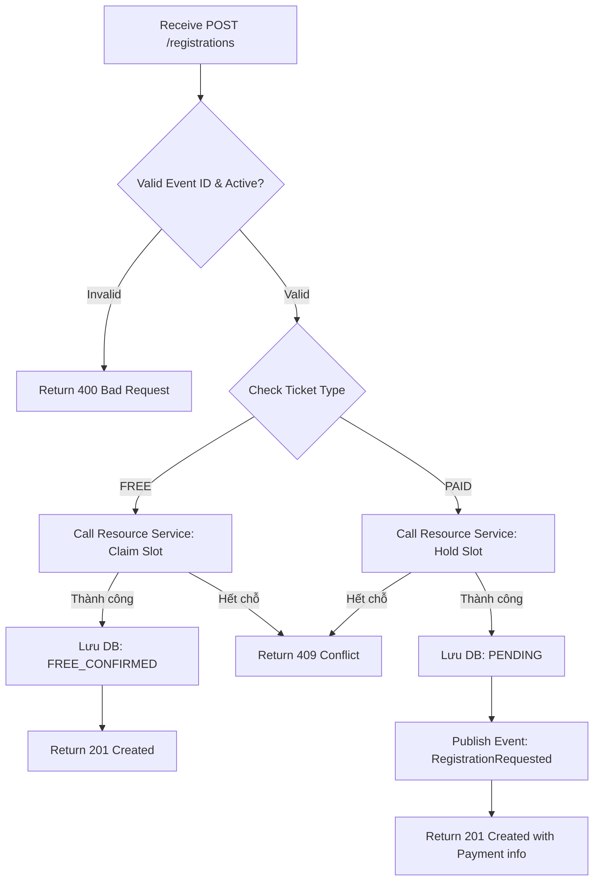

# Analysis and Design — Domain-Driven Design Approach

## Part 1 — Domain Discovery

### 1.1 Business Process Definition

- **Domain**: Hệ thống Quản lý Sự kiện Nội bộ Doanh nghiệp (Internal Event Management).
- **Business Process**: Vòng đời tổ chức và tham gia sự kiện nội bộ, bao gồm việc lên kế hoạch, đăng ký (miễn phí/có phí), thanh toán, điểm danh bằng QR và thống kê.
- **Actors**:
  - **Organizer (Ban tổ chức):** Tạo, cấu hình sự kiện, quản lý tài nguyên, phát hành QR điểm danh, theo dõi thống kê.
  - **Employee (Nhân viên):** Xem danh sách sự kiện, đăng ký tham gia, thanh toán vé (nếu có), quét QR để điểm danh.
- **Scope**: Từ khi tạo sự kiện, quản lý tài nguyên, mở đăng ký, xử lý thanh toán (Saga) cho đến khi sự kiện kết thúc và thống kê check-in.

### 1.2 Existing Automation Systems

List existing systems, databases, or legacy logic related to this process.

| System Name | Type | Current Role | Interaction Method |
|-------------|------|--------------|-------------------|
| Payment Gateway (VNPay/Momo) | External Payment | Xử lý giao dịch thanh toán vé sự kiện | Sync REST + Async Webhook |

### 1.3 Non-Functional Requirements

Non-functional requirements help justify design decisions in later steps.

| Requirement    | Description |
|----------------|-------------|
| Performance    | ...         |
| Security       | ...         |
| Scalability    | ...         |
| Availability   | ...         |

---

## Part 2 — Strategic Domain-Driven Design

### 2.1 Ubiquitous Language

| Term | Definition | Example |
|------|-----------|---------|
| **Event** | Sự kiện nội bộ do công ty tổ chức, có giới hạn sức chứa, thời gian bắt đầu và kết thúc rõ ràng. | Organizer tạo Event "Tech Talk 2026". |
| **Resource** | Tài nguyên vật lý (phòng họp, hội trường) được dùng để tổ chức Event. | Event được gán Resource là "Hội trường A". |
| **Slot** | Một suất trống hoặc chỗ ngồi trong Resource/Event. | Employee claim 1 Slot khi đăng ký. |
| **Registration** | Hồ sơ đăng ký tham gia sự kiện của một Employee. | Employee gửi yêu cầu Registration. |
| **Payment (Saga)** | Quy trình thanh toán cho vé sự kiện trả phí, liên kết chặt chẽ với Registration. | Hệ thống khởi tạo Payment Requested. |
| **QR Session** | Phiên quét mã QR được chiếu lên màn hình để điểm danh. | Organizer làm mới QR Session sau mỗi 30 giây. |
| **Attendance** | Kết quả điểm danh của Employee tại sự kiện. | Employee quét QR để ghi nhận Attendance. |

### 2.2 Event Storming — Domain Events

https://miro.com/app/board/uXjVHykfwH4=/

| # | Domain Event | Description |
|---|-------------|-------------|
| 1 | `EmployeeLoggedIn` | Nhân viên hoặc Ban tổ chức đăng nhập thành công. |
| 2 | `ResourceCreated` / `ResourceConfigured` | Tài nguyên (phòng/thiết bị) được tạo và cấu hình. |
| 3 | `EventCreated` / `EventDetailsConfigured` / `EventPublished` | Sự kiện được tạo, cấu hình và công bố. |
| 4 | `EventRegistrationOpened` | Sự kiện chính thức mở đăng ký theo lịch. |
| 5 | `SlotClaimed` / `TemporarySlotHeld` / `SlotReleased` | Một chỗ ngồi được xác nhận, giữ chỗ tạm thời (chờ thanh toán), hoặc nhả ra. |
| 6 | `RegistrationRequested` | Nhân viên gửi yêu cầu đăng ký tham gia sự kiện. |
| 7 | `FreeRegistrationConfirmed` / `PaidRegistrationConfirmed` | Đăng ký được xác nhận (miễn phí hoặc đã thanh toán thành công). |
| 8 | `PaymentRequested` / `PaymentSucceeded` / `PaymentFailed` | Giao dịch thanh toán được khởi tạo, thành công hoặc thất bại. |
| 9 | `PaidRegistrationRolledBack` / `RegistrationCancelled` | Đăng ký bị hủy (do timeout thanh toán hoặc do nhân viên tự hủy). |
| 10 | `ConfirmationSent` / `ReminderSent` | Gửi email thông báo xác nhận hoặc nhắc nhở tham gia sự kiện. |
| 11 | `SharedCheckInQrDisplayed` / `SharedQrRefreshed` | Mã QR dùng chung được hiển thị trên màn hình và tự làm mới. |
| 12 | `SharedQrScannedForCheckIn` / `ParticipantCheckedIn` | Nhân viên quét QR và được ghi nhận check-in thành công. |
| 13 | `RegistrationMetricsUpdated` / `AttendanceMetricsUpdated` | Số liệu thống kê đăng ký, điểm danh được cập nhật (CQRS). |

### 2.3 Commands and Actors

| Command | Actor | Triggers Event(s) | Description |
|---------|-------|--------------------|-------------|
| `Login` | Employee/Organizer | `EmployeeLoggedIn` | Đăng nhập hệ thống |
| `CreateResource` / `ConfigureResource` | Organizer | `ResourceCreated`, `ResourceConfigured` | Khai báo và cấu hình sức chứa phòng ban |
| `CreateEvent` / `PublishEvent` | Organizer | `EventCreated`, `EventPublished` | Tạo và công bố sự kiện |
| `RegisterForEvent` | Employee | `RegistrationRequested` | Nhân viên đăng ký tham gia sự kiện |
| `ClaimSlot` / `HoldSlotTemporarily` | System (Policy) | `SlotClaimed`, `TemporarySlotHeld` | Xử lý giữ chỗ / khóa chỗ tùy vào loại vé |
| `RequestPayment` / `ConfirmPayment` | System / Gateway | `PaymentRequested`, `PaymentSucceeded` | Xử lý giao dịch với VNPay/Momo |
| `RollbackPaidRegistration` | System (Saga) | `PaidRegistrationRolledBack`, `SlotReleased` | Hoàn tác đăng ký nếu thanh toán lỗi/timeout |
| `DisplayCheckInQr` / `RefreshSharedQr` | Organizer | `SharedCheckInQrDisplayed`, `SharedQrRefreshed` | Hiển thị mã QR điểm danh lên màn hình |
| `ScanDisplayedQrForCheckIn` | Employee | `SharedQrScannedForCheckIn`, `ParticipantCheckedIn` | Nhân viên dùng điện thoại quét mã |
| `UpdateRegistrationMetrics` | System (CQRS) | `RegistrationMetricsUpdated` | Cập nhật dashboard thống kê |

### 2.4 Aggregates

| Aggregate | Root Entity | Commands | Domain Events | Key Business Rules |
|-----------|------------|----------|---------------|--------------------|
| **EmployeeAccount** | `EmployeeAccount` | `Login` | `EmployeeLoggedIn` | Phân quyền ORGANIZER / EMPLOYEE |
| **Resource** | `Resource` | `CreateResource`, `ConfigureResource` | `ResourceCreated` | Cấu hình loại, trạng thái, sức chứa |
| **Slot** | `Capacity` (VO) | `ClaimSlot`, `HoldSlotTemporarily`, `ReleaseSlot` | `SlotClaimed`, `TemporarySlotHeld` | Không vượt quá `Capacity`, giữ chỗ có timeout |
| **Event** | `Event` | `CreateEvent`, `ConfigureDetails`, `PublishEvent` | `EventPublished`, `EventCancelled` | Validation thời gian bắt đầu/kết thúc, vé FREE/PAID |
| **Registration** | `Registration` | `RegisterForEvent`, `ConfirmPaid`, `RollbackPaid` | `RegistrationRequested`, `PaidRegistrationConfirmed` | 1 Employee chỉ đăng ký 1 lần/Event |
| **Payment** | `Payment` | `RequestPayment`, `ConfirmPayment`, `FailPayment` | `PaymentSucceeded`, `PaymentFailed` | Saga: PaymentFailed -> Rollback Registration |
| **Notification** | `Notification` | `SendConfirmation`, `SendReminder` | `ConfirmationSent`, `ReminderSent` | Phân phối qua Email/Push dựa theo Channel |
| **QRSession** | `QRSession` | `DisplayCheckInQr`, `RefreshSharedQr` | `SharedQrRefreshed` | Token quét chỉ có hiệu lực ngắn hạn (vd: 30s) |
| **Attendance** | `Attendance` | `ValidateSharedQrForCheckIn` | `ParticipantCheckedIn`, `DuplicateCheckInRejected` | Ngăn chặn Check-in trùng lặp |
| **EventMetrics** | `EventMetrics` | `UpdateRegistrationMetrics`, `UpdateAttendanceMetrics` | `CheckInRateCalculated` | Read Model tổng hợp dữ liệu từ Event Stream |

### 2.5 Bounded Contexts

| Bounded Context | Aggregates Included | Responsibility | Service Candidate |
|-----------------|---------------------|----------------|-------------------|
| **Identity & Access** | EmployeeAccount | Xác thực, ủy quyền (JWT), quản lý user | `iam-service` |
| **Resource** | Resource, Slot | Quản lý danh mục phòng ốc, giữ/nhả sức chứa | `resource-service` |
| **Event Planning** | Event | Tổ chức, cấu hình và phát hành sự kiện | `event-service` |
| **Registration** | Registration | Nhận đăng ký, điều phối logic Slot và Payment | `registration-service` |
| **Payment** | Payment, Refund | Giao tiếp với VNPay/Momo, hoàn tiền, Saga | `payment-service` |
| **Notification** | Notification | Gửi Email, Push Notification, Calendar | `notification-service` |
| **Attendance** | QRSession, Attendance | Sinh QR điểm danh, quét QR và xác thực vào/ra | `attendance-service` |
| **Analytics** | EventMetrics | CQRS Dashboard thống kê đăng ký và điểm danh | `analytics-service` |

### 2.6 Context Map

**Mối quan hệ chính:**
- **IAM (OHS) -> Tất cả Service (CF):** Cung cấp API Authentication chung. Downstream dùng JWT Token làm Published Language.
- **Registration <-> Payment (Partnership):** Sử dụng **Saga Pattern** để giữ chỗ (Hold Slot), yêu cầu thanh toán (Request Payment), xác nhận nếu thành công (Confirm), hoặc hoàn tác (Rollback/Release Slot) nếu lỗi/timeout.
- **Analytics (Read Model):** CQRS thuần thụ động, lắng nghe Event (Kafka) từ các service khác (Event, Registration, Attendance, Payment) để update Dashboard mà không làm chậm các luồng Write/Core.
- **Payment -> External Gateway (ACL):** Sử dụng Anti-Corruption Layer để bảo vệ domain nội bộ khỏi sự thay đổi từ cấu trúc API của Momo.

### 2.7 Service Composition

*(Luồng đăng ký vé có phí - Saga Orchestration/Choreography)*

## Part 3 — Service-Oriented Design

### 3.1 Uniform Contract Design

*(Tham khảo thêm chi tiết trong `docs/api-specs/`)*

**Registration Service:**

| Endpoint | Method | Description | Request Body | Response Codes |
|----------|--------|-------------|--------------|----------------|
| `/api/v1/registrations` | POST | Gửi yêu cầu đăng ký tham gia sự kiện | `{"eventId": "uuid"}` | 201 Created, 400, 409 |
| `/api/v1/registrations/my` | GET | Lấy danh sách sự kiện đã đăng ký của user | | 200 OK |
| `/api/v1/registrations/{id}/cancel` | POST | Hủy đăng ký | `{"reason": "string"}` | 200 OK, 404 |

**Attendance Service:**

| Endpoint | Method | Description | Request Body | Response Codes |
|----------|--------|-------------|--------------|----------------|
| `/api/v1/attendance/qr/display` | POST | Ban tổ chức bật hiển thị mã QR | `{"eventId": "uuid"}` | 201 Created, 403 |
| `/api/v1/attendance/qr/refresh` | POST | Refresh mã QR để chống cheat | `{"sessionId": "uuid"}` | 200 OK |
| `/api/v1/attendance/scan` | POST | Nhân viên quét QR để Check-in | `{"qrToken": "string"}` | 200 OK, 400 Invalid/Expired |

### 3.2 Service Logic Design

**Registration Service (Xử lý Đăng ký):**

