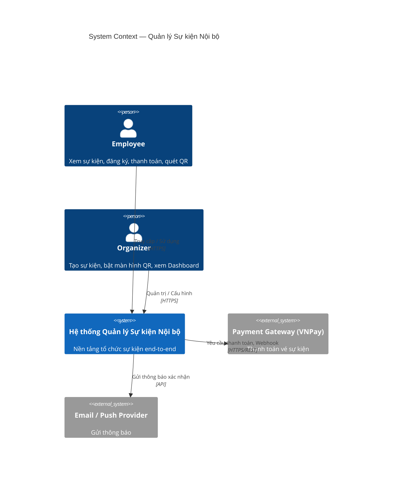
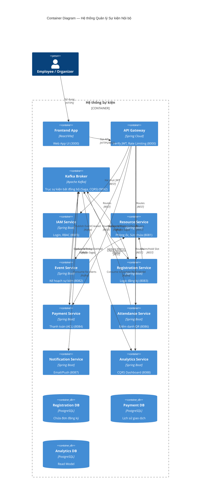

# System Architecture

## 1. Pattern Selection

| Pattern | Selected? | Derived from (Analysis Step) | Business/Technical Justification |
|---------|-----------|-----------------------------|----------------------------------|
| API Gateway | ✅        | 2.6 Context Map | Điểm vào duy nhất, xác thực JWT (IAM CF) tập trung và định tuyến. |
| Database per Service | ✅        | 1.3 NFR, 2.5 Bounded Contexts | Tách bạch dữ liệu giữa Core và Supporting domain, đảm bảo độc lập triển khai. |
| Shared Database | ❌        | | Không sử dụng. Mỗi service quản lý data riêng. |
| Saga | ✅        | 2.6 Context Map | Quản lý giao dịch phân tán giữa Registration và Payment (Partnership). |
| Event-driven / Message Queue | ✅        | 2.6 Context Map, 1.3 NFR | Giải quyết bất đồng bộ, giảm tải hệ thống (Notification, Analytics, Event Planning). |
| CQRS | ✅        | 2.6 Context Map | Tách biệt Model đọc (Analytics Service) và Model ghi (Core Services) để tối ưu truy vấn Dashboard. |
| Circuit Breaker | ✅        | 2.6 Context Map | Chống lỗi dây chuyền khi gọi Payment Gateway (VNPay/Momo) bị timeout. |
| Service Registry / Discovery |           |  |  |

---

## 2. System Components

| Component     | Responsibility | Tech Stack      | Port  |
|---------------|----------------|-----------------|-------|
| **Frontend**  | Giao diện Employee/Organizer | React / Vite | 3000  |
| **Gateway**   | Routing, JWT Auth | Spring Cloud Gateway | 8000  |
| **IAM Service**| Quản lý user, cấp JWT | Spring Boot, PostgreSQL | 8085  |
| **Resource Svc**| Danh mục phòng/thiết bị | Spring Boot, PostgreSQL | 8081  |
| **Event Svc** | Cấu hình sự kiện | Spring Boot, PostgreSQL | 8082  |
| **Registration Svc**| Giữ chỗ, đăng ký (Core) | Spring Boot, PostgreSQL | 8083  |
| **Payment Svc**| Xử lý thanh toán, Saga | Spring Boot, PostgreSQL | 8084  |
| **Attendance Svc**| Sinh QR, kiểm tra check-in | Spring Boot, Redis, PG | 8086  |
| **Notification Svc**| Gửi Email/Push | Spring Boot, PostgreSQL | 8087  |
| **Analytics Svc**| Dashboard thống kê (CQRS) | Spring Boot, PostgreSQL | 8088  |

---

## 3. Communication

### Inter-service Communication Matrix

| From → To     | IAM | Resource | Event | Registration | Payment | Attendance | Notification | Analytics | DBs | Kafka |
|---------------|-----|----------|-------|--------------|---------|------------|--------------|-----------|-----|-------|
| **Frontend**  | —   | —        | —     | —            | —       | —          | —            | —         | —   | —     |
| **Gateway**   | REST| REST     | REST  | REST         | REST    | REST       | REST         | REST      | —   | —     |
| **Event Svc** | —   | REST     | —     | —            | —       | —          | —            | —         | TCP | async |
| **Registration**| — | REST     | —     | —            | —       | —          | —            | —         | TCP | async |
| **Payment Svc**| —  | —        | —     | —            | —       | —          | —            | —         | TCP | async |
| **Attendance**| —   | —        | —     | —            | —       | —          | —            | —         | TCP | async |

---

## 4. Architecture Diagram

### 4.1 System Context (C4 Level 1)

### 4.2 Container Diagram (C4 Level 2) — Full Deployment View

---

## 5. Deployment

- Tất cả dịch vụ được đóng gói (Containerized) bằng Docker
- Quản lý điều phối qua Docker Compose (`docker-compose.yml`)
- DNS nội bộ: `http://registration-service:8083`, `http://kafka:9092`
- Lệnh chạy: `docker compose up --build`
