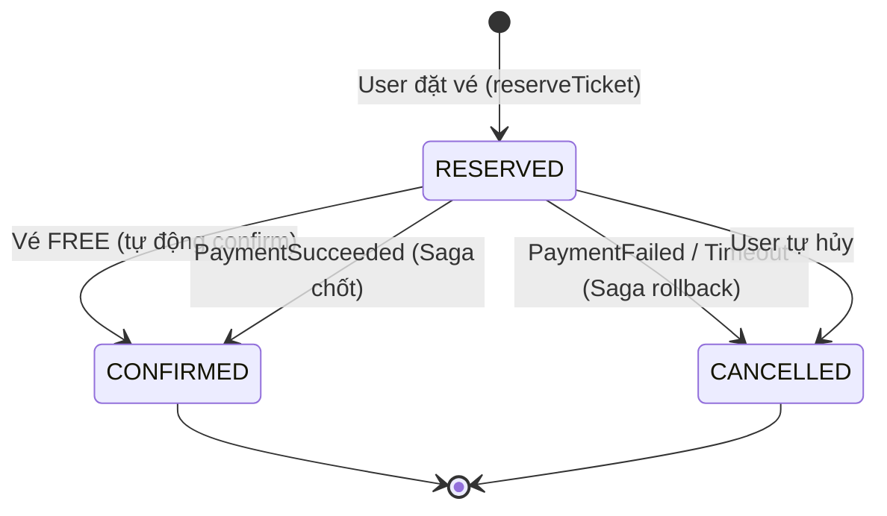
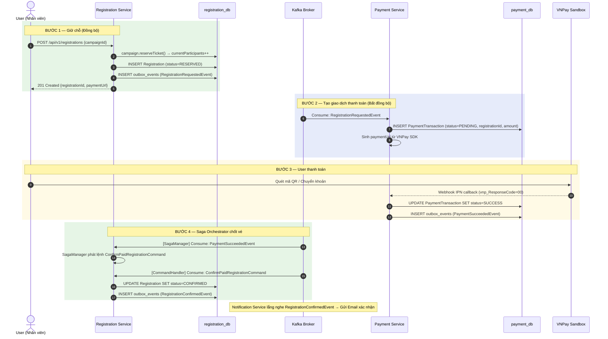
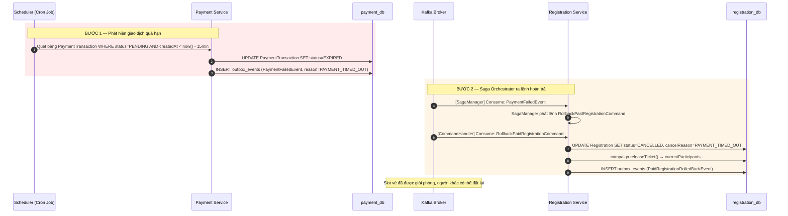

# Thiết kế chi tiết: Saga Orchestration — Luồng Thanh Toán Vé

## 1. Tổng quan kiến trúc

Hệ thống sử dụng mẫu **Saga Orchestration**  để quản lý giao dịch phân tán giữa 2 Bounded Context:

| Service | Vai trò trong Saga | Database |
|---|---|---|
| **Registration Service** | Orchestrator — Sở hữu vòng đời đăng ký vé | `registration_db` |
| **Payment Service** | Participant — Xử lý thu/hoàn tiền | `payment_db` |

## 2. State Machine — Vòng đời đăng ký vé

**Phân nhánh tại `reserveTicket()`:**
- **Vé FREE:** `Registration.createNew(campaignId, userId, isFreeTicket=true)` → Trạng thái `CONFIRMED` ngay lập tức → KHÔNG kích hoạt Saga.
- **Vé PAID:** `Registration.createNew(campaignId, userId, isFreeTicket=false)` → Trạng thái `RESERVED` → Bắn `RegistrationRequestedEvent` lên Kafka → Kích hoạt Saga.

---

## 3. Sequence Diagram

### 3.1. Happy Path — Thanh toán thành công

### 3.2. Sad Path — Thanh toán thất bại / Hết hạn (Compensating Transaction)

---

## 4. Kafka Topics & Message Flow

### 4.1. Bản đồ Topics

| Topic Name | Producer | Consumer | Mục đích |
|---|---|---|---|
| `registration-events` | Registration Service | Payment Service, Notification | Domain Events của Registration |
| `payment-events` | Payment Service | Registration Service (SagaManager) | Kết quả thanh toán |
| `registration-commands` | SagaManager (nội bộ) | Registration Service (CommandHandler) | Lệnh điều phối Saga |

### 4.2. Danh sách Messages

**Events (Sự kiện — Thông báo kết quả):**

| Message | Payload chính | Ai bắn? | Ai nghe? |
|---|---|---|---|
| `RegistrationRequestedEvent` | registrationId, campaignId, employeeId | Registration | Payment |
| `RegistrationConfirmedEvent` | registrationId, campaignId, paymentId | Registration | Notification |
| `PaidRegistrationRolledBackEvent` | registrationId, reason | Registration | Notification |
| `PaymentSucceededEvent` | paymentId, registrationId, amount | Payment | SagaManager |
| `PaymentFailedEvent` | paymentId, registrationId, reason | Payment | SagaManager |

**Commands (Lệnh — Yêu cầu hành động):**

| Message | Payload chính | Ai bắn? | Ai nghe? |
|---|---|---|---|
| `ConfirmPaidRegistrationCommand` | registrationId, paymentId | SagaManager | Registration CommandHandler |
| `RollbackPaidRegistrationCommand` | registrationId, reason | SagaManager | Registration CommandHandler |
